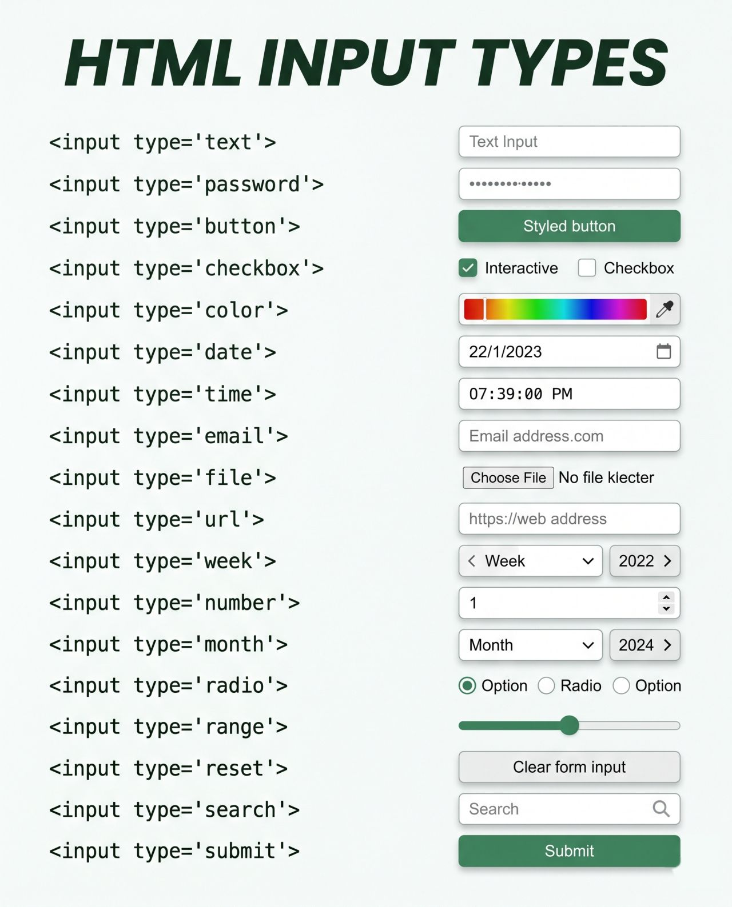
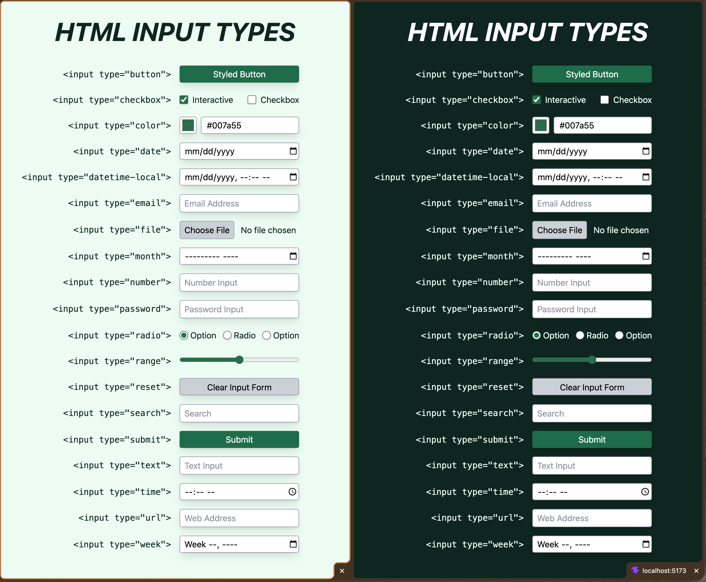
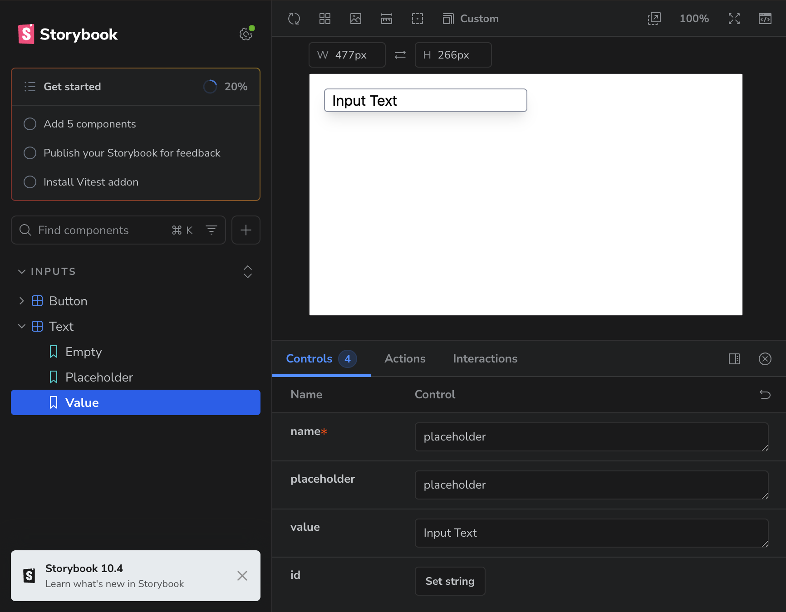

# React Input Component Library

I found [a LinkedIn post](https://www.linkedin.com/posts/nisha-narola-458325271_me-boss-i-need-3-days-to-build-a-secure-activity-7465315168252489729-hdFZ?utm_source=social_share_send&utm_medium=member_desktop_web&rcm=ACoAAAsrMzYBxLO4gZrBUpCEbQ2Kr4v_HVHYTpw) demonstrating how input types are already well-implemented in HTML5. While I mostly agree, the image mockup provided doesn't imitate exactly how input fields look out of the box—they're still ugly.

This project aims to demonstrate exactly how much more code goes into a styled input, compared to the `<input type='[insert type here]'>` syntax shown. Unfortunately, it isn't _quite_ that simple!

## The Post

> ### [Nisha Narola](https://www.linkedin.com/in/nisha-narola-458325271/), Web Developer
> Me: "Boss, I need 3 days to build a secure password field, a color sampler, and a custom range slider for the new UI."
> HTML5: "Am I a joke to you?" 👁️👁️
>
> Seriously, sometimes we get so lost in React, Vue, and NPM packages that we forget how powerful basic HTML actually is. You can literally build a whole interactive form using just native tags.
> Save your time, save your company's money, and please... stop installing an NPM package for a simple slider. 🛑
> What’s the most useless package you’ve ever installed for something HTML could do natively?



## My Take

Sure, I agree a NPM package for a slider is overkill. But I wanted to see exactly how much work goes into rendering each of these components, and took it a step farther.

If I'm being completely honest, I think this…

```
<InputText name="text" placeholder="Text Input" value="Hello, World!" />
```

…reads much more cleanly than this.

```
<input id="text" name="text" placeholder="Text Input" type="text" class="bg-white border border-gray-400 indent-2 placeholder-gray-400 rounded shadow-lg text-black w-56">Hello, World!</input>
```

## My Implementation

### Mockup



> [!WARNING]
> As of writing, this is a WIP for demonstration purposes only. The only components that are implemented the way I'd like are `InputButton` and `InputText` (i.e. the basics; see https://github.com/McCarthyCode/input/issues/1). This was due entirely to time constraints.

### Storybook



### The Stack

**React + Vite + TailwindCSS + Storybook**

### Features

- Independent React components
- Input fields extended to _all_ types, not just what's shown in the image
- Light/Dark scheme awareness (based on system and browser settings)
- Responsive layout (that is, the list collapses on smaller screens)
